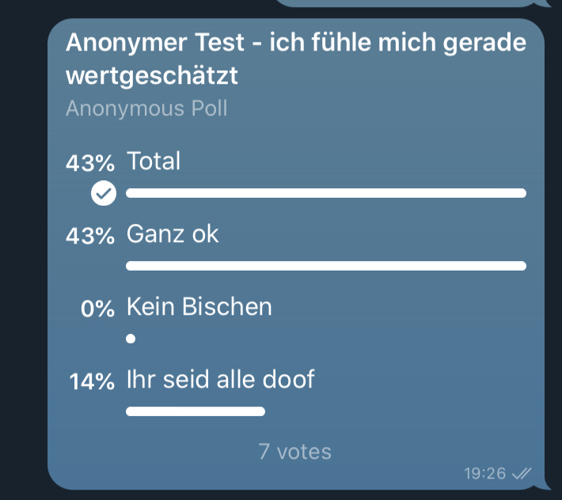

# bestes-team-bot

A simplest-posssible Telegram chatbot to get instant feedback from the team

## Why the bestes-team-bot

Most teams do yearly satisfaction surveys or if they breathe agile, maybe monthly retrospectives. However there's usually no quick, automatic and fun way of a weekly anonymous feedback. Let's fix this.,

## What does it do?

The bestes-team-bot randomly posts a survey in the team Telegram group out of a specified list of configured questions and options. Telegram keeps the answers anonymous and easy to answer.

## Installation and Deployment

Follow these stepss to create the bestes-team-bot:

- In your team Telegram group, chat to `@botfather` with the command `/newbot`. Write down your API key.
- Invite the created bot to your team group. To get the ID of your group, call the following URL in the browser: `https://api.telegram.org/<apiKey>/getUpdates`. In the resulting JSON, there's an `id` field with a negative number, which is your group ID. Write down the Group ID.
- Create a new serverless Azure function in Python. The easiest way is to use the Azure extension in VSCode and click on "Add Azure function". This will create a bunch of files, e.g. the `local.settings.json`. Add
  - "CHAT_ID": <group ID>
  - "TELEGRAM_TOKEN": <API token>
- In Azure, setup a timer, that triggers your survey, e.g. on Fridays at 2pm.
